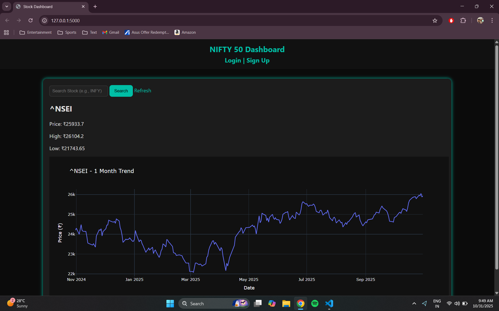
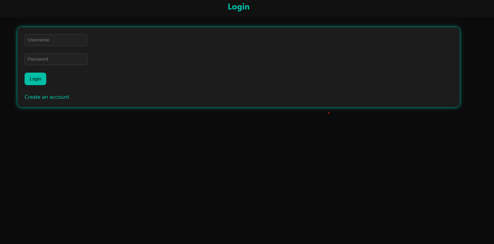
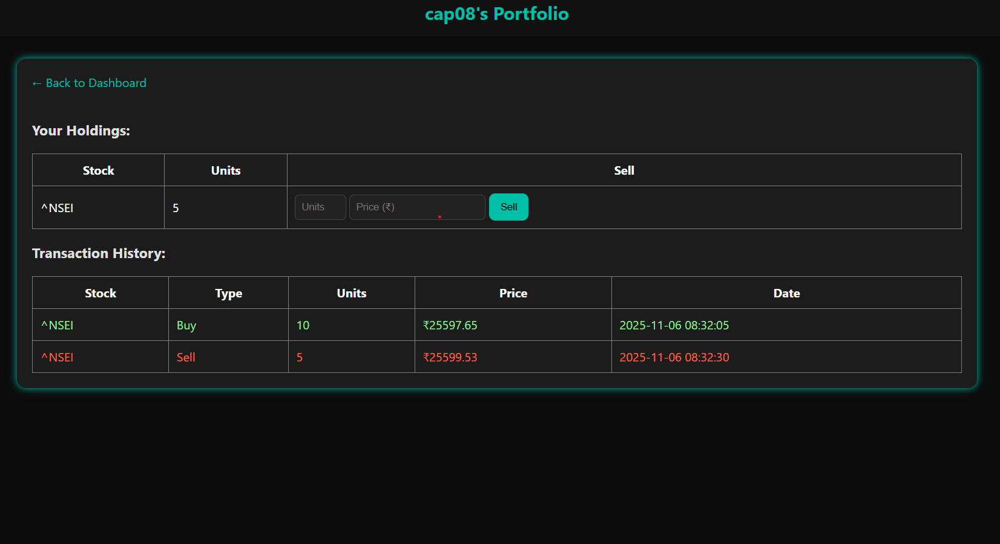

# NIFTY 50 Stock Dashboard

A Flask web app for tracking NIFTY 50 / NSE stock prices and managing a simple simulated portfolio (buy/sell) with user accounts.

## Features
- Live stock data via `yfinance` (12-month price trend chart with Plotly)
- Search any NSE symbol
- User signup/login (passwords hashed with Werkzeug)
- Buy/sell stocks and track holdings
- Transaction history per user

## Project structure
```
.
├── app.py
├── requirements.txt
├── portfolio.db          # created automatically on first run (git-ignored)
├── static/
│   └── style.css
├── templates/
│   ├── index.html
│   ├── login.html
│   ├── signup.html
│   └── portfolio.html
└── pics/                 # screenshots
    ├── home_page.png
    ├── login.png
    └── portfolio.png
```

## Setup (one-time)
```bash
python -m venv venv
source venv/bin/activate   # Windows: venv\Scripts\activate
pip install -r requirements.txt
```

## Running it
**Windows — one click:** double-click `start_app.bat`. It starts the server in the background and opens the dashboard in your browser automatically. Double-click `stop_app.bat` when you're done to shut the server down.

**Manual (any OS):**
```bash
python app.py
```
Then open `http://127.0.0.1:5000` yourself.

The SQLite database (`portfolio.db`) and its tables are created automatically on first run.

## Screenshots
| Home | Login | Portfolio |
|---|---|---|
|  |  |  |

## Notes / TODO
- `app.secret_key` is currently a placeholder — set it via an environment variable before deploying.
- No `.env` support yet; consider `python-dotenv` for secrets/config.
